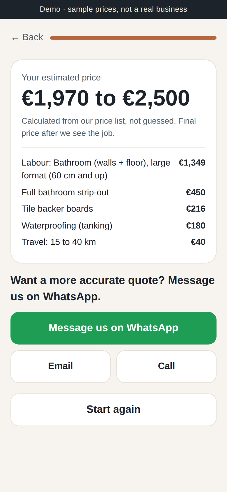

# Trades Quote Calculator

A mobile-first one-page site for a tiling or bathroom business with a step-by-step quote calculator.
Customers scan a QR code, answer a few big-button questions and get a price range. One tap opens
WhatsApp with the job details and the estimate already typed in. Email and Call sit next to it.

**Live demo:** https://alibek88alarko.github.io/trades-quote-calculator/

**The price never comes from AI.** Every amount is calculated from `pricing.json`, the owner's price list.
An unknown option or a bad area is refused, not guessed.



## What the customer answers
Job type, approximate m², tile size, removal, preparation (levelling, boards, tanking), who supplies the
tiles, distance and timeframe, optional photos.

## Pricing rules (`pricing.json`, sample data)
- labour per m² by job type, plus a base amount for bathrooms and showers
- tile size multiplier (mosaic and large format cost more to lay)
- removal per m² or a fixed strip-out price
- preparation per m²
- tiles per m² with wastage when the business supplies them
- travel by distance zone, rush or flexible timing adjustment
- minimum job charge, range spread and rounding

Change a number in the file and the calculator follows. No code changes needed.

## WhatsApp handoff
`wa.me` links carry text only, so photos can't ride along. The page tells the customer to attach their
photos in the chat after it opens. The full version stores uploads and puts a link in the message.

## Run it
Static files, no build step. Serve the folder with any web server:

```
python3 -m http.server 8000
# open http://localhost:8000
```

Tests for the pricing logic:

```
node quote.test.js
```

Works on GitHub Pages, Cloudflare Pages or Netlify as is.

## Status
Demo with sample prices and placeholder gallery. Not a real business.

License: MIT
